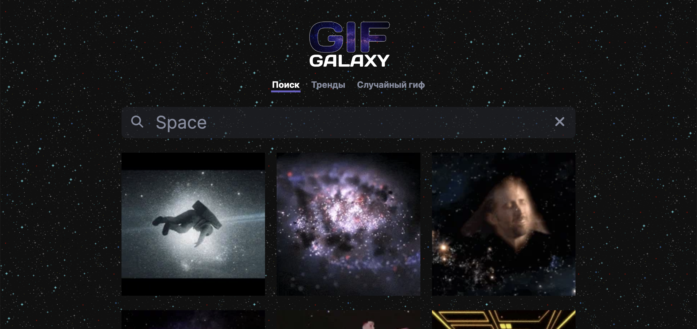

# GIF GALAXY

Web application for searching gifs using the GIPHY API.

## Description

GIF GALAXY is a web application designed to allow users to easily search and discover gifs using the GIPHY API. The application is built using React, React Router, JavaScript, and CSS.

This project was developed collaboratively with [Viktor Kikodze](https://github.com/vitland) as part of our goal to improve our teamwork skills.

## Features

- Search for gifs using keywords
- View trending gifs
- Get a random gif 

## Usage

1. Visit the GIF GALAXY [Link to the **GitHub Pages**](https://vitland.github.io/GifGalaxy/)
2. Use the search bar to enter keywords and find related gifs.
3. Explore the trending section to see popular gifs.
4. Enjoy an endless collection of gifs!

## Contributors

- [Andrei Stepanov](https://github.com/Bababum95)
- [Viktor Kikodze](https://github.com/vitland)